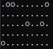
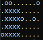

**BSQ:** 
## ***A 42 project... :***
## Requirement:
You must be on a Linux distribution or macOS.
## Usage:
Launch make in the repository and than use the following command to create a map :  ./tableau.sh x y z > map.txt

x = number of row in the x axe

y = number of row in the y axe

z = density of obstacle

For example, the command :"./tableau.sh 100 100 10 > map.txt" will create a map of 100x100 with a density of 10.
Now that you have your map, you can use the program BSQ to find the biggest square drawable in the map:
./BSQ map.txt

## Goal:

- [x] No memory leaks
- [x] Norm

The goal of this project is to make a program which is able to find the biggest square possible in a map without going through any obstacles.

For example, here's a map:

And here's the biggest square drawable in this map:

